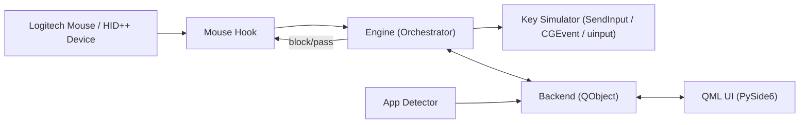

# Development Guide

This document contains the technical details a developer needs to navigate Mouser. The user-facing tour lives in [README.md](README.md); this guide covers how the codebase is wired together, how the platform-specific hooks behave, and how to build / debug locally.

## Contents

- [Development setup](#development-setup)
- [Architecture](#architecture)
- [Entry point: `main_qml.py`](#entry-point-main_qmlpy)
- [How it works](#how-it-works)
  - [Mouse hook](#mouse-hook)
  - [Device catalog & layout registry](#device-catalog--layout-registry)
  - [Gesture button detection](#gesture-button-detection)
  - [App detector](#app-detector)
  - [Engine](#engine)
  - [Device reconnection](#device-reconnection)
  - [Configuration](#configuration)
- [UI overview](#ui-overview)
- [Project structure](#project-structure)
- [CLI flags & debug overrides](#cli-flags--debug-overrides)
- [Build internals](#build-internals)
- [Desktop shortcut (Windows)](#desktop-shortcut-windows)
- [Debugging tips](#debugging-tips)

## Development setup

Install the project dependencies before running the app or test suite. Do not rely on the system Python unless it already has the requirements installed.

```bash
python3 -m venv .venv
source .venv/bin/activate
python -m pip install -r requirements.txt
```

On macOS, `requirements.txt` installs PyObjC (`objc`, Quartz, and AppKit bindings), which Mouser needs for CGEventTap, app detection, and key simulation.

Run the test suite from the activated environment:

```bash
python -m unittest discover -s tests
```

## Entry Point: `main_qml.py`

`main_qml.py` is the primary launch script for Mouser, bringing together the core processing logic (Engine) and the graphical user interface (QML Backend). It replaces an older `tkinter`-based interface.

### What the Code is Responsible For

- **Environment Setup:** Defines absolute paths to handle both dev environments and frozen PyInstaller executables (`.app` bundles on macOS, `_internal` on Windows).
- **App Initialization:** Creates the `QApplication` and configures the Qt Material theme.
- **Engine Bootstrapping:** Initializes the core HID (Human Interface Device) engine and the UI backend.
- **QML Loading:** Registers context properties and image providers, then loads `Main.qml`.
- **System Integration:** Sets up the OS system tray / menu-bar icon, checks macOS accessibility permissions, syncs login-item state, and binds system-wide dark/light mode states.

### Key Classes and Functions

- `main()`: The main entry point. Orchestrates the startup sequence, initializes the `Engine` and `Backend`, loads the QML files, exposes Python objects to QML, creates the system tray, and starts the Qt event loop (`app.exec()`).
- `UiState(QObject)`: A bridge class that tracks the OS's system appearance (Dark vs. Light mode) and exposes it to the QML frontend via Qt Properties and Signals.
- `_check_accessibility()`: A macOS-specific function that checks (and prompts) the user for Accessibility Permissions. This is crucial for intercepting or simulating mouse/keyboard events on Mac.
- `core/accessibility.py`: Centralizes the native macOS trust check used by both startup and backend-exposed state.
- `core/startup.py`: Owns login startup integration on both Windows and macOS, including the per-user macOS LaunchAgent used by the **Start at login** UI toggle.
- `AppIconProvider` & `SystemIconProvider`: Subclasses of `QQuickImageProvider`. QML uses these to request images dynamically (e.g., rendering SVGs cleanly at various DPIs or reading native file icons via `QFileIconProvider`).
- `_app_icon()`, `_tray_icon()`, & `_render_svg_pixmap()`: Utility functions that construct high-resolution (`QIcon` / `QPixmap`) icons for the taskbar and the system tray, handling platform differences.

### How Data Flows Through the Code

1. **Configuration Flow:** Command-line args are parsed (`_parse_cli_args`) to configure hardware specifics like `--hid-backend` and startup behavior such as `--start-hidden`.
2. **Setup Flow:** The `Engine()` (core logic) and `Backend()` (QML interface) are instantiated.
3. **QML Binding:** Instances of the `Backend` and `UiState` are injected directly into the QML engine's root context. This allows the QML JavaScript/UI layer to read application state and invoke methods on the Python objects.
4. **Execution Flow:**
   - `qml_engine.load(...)` parses and renders `Main.qml`.
   - A deferral (`QTimer.singleShot(0, ...)`) is queued to start the `Engine` asynchronously.
   - If `--start-hidden` is present, the window is kept hidden and Mouser starts as a tray / menu-bar app first.
   - Execution hands over to `app.exec()`, blocking the main thread to run the Qt UI event loop.
   - `engine.stop()` gracefully shuts down background threads when the Qt event loop terminates.

### Non-Obvious Decisions and Tradeoffs

- **PyInstaller Pathing (`getattr(sys, "frozen", ...)`)**: Handles the different execution environments. Running via `python main_qml.py` uses local paths, but running a compiled PyInstaller build uses paths nested in the macOS `.app/Contents/Resources` or Windows `_internal` folders.
- **Deferred Engine Start:** The core `engine.start()` is wrapped in `QTimer.singleShot(0, ...)`. This ensures the graphical window renders and appears BEFORE the potentially blocking process of binding to HID devices occurs.
- **Hardcoded PySide6 Plugin Paths:** `QML2_IMPORT_PATH` and `QT_PLUGIN_PATH` are manually set via `os.environ` to work around PyInstaller/PySide6 edge cases where the QML engine fails to locate basic QML modules when bundled.
- **LaunchAgent Wiring:** macOS autostart is implemented as a per-user LaunchAgent that launches either the frozen app executable or the current interpreter plus `main_qml.py`, so the same UI toggle works in packaged and source-based workflows.
- **Centralized Accessibility Check:** The backend and startup path share the same native trust check from `core/accessibility.py`, avoiding drift between the permission banner and the live settings state.
- **macOS System Tray Contrast:** The system tray icon provides two different SVGs (black and white) marked as `Normal` and `Selected`. This macOS-specific trick ensures the menu bar icon automatically inverts color appropriately when the user selects it or toggles dark/light mode.
- **macOS Debugging (`SIGUSR1`):** A custom signal handler `signal.signal(signal.SIGUSR1, _dump_threads)` is registered, providing developers a hidden way to dump all thread stack traces directly to the terminal via `kill -SIGUSR1 <pid>`. This is highly useful for debugging cross-thread freezing bugs without a debugger attached.
- **Startup Benchmarks:** Explicit timing logic (`_t0`, `_t1`, ..., `_t8`) is used to profile startup times. Because importing heavy UI frameworks like Qt in Python can be slow, this enforces performance budgets.

## Architecture



The arrows match the runtime call graph: the OS-level mouse hook feeds events into the `Engine`, which decides whether to suppress and rewrite them (firing `Key Simulator`) or pass them through. Connection state and device identity flow back through `Backend` and into QML so the UI stays in sync.

## How it works

### Mouse hook

Mouser exposes a single `MouseHook` façade in [`core/mouse_hook.py`](core/mouse_hook.py) and dispatches to a per-platform implementation:

- **Windows** — [`core/mouse_hook_windows.py`](core/mouse_hook_windows.py): `SetWindowsHookExW` with `WH_MOUSE_LL` on a dedicated background thread, plus Raw Input for extra mouse data.
- **macOS** — [`core/mouse_hook_macos.py`](core/mouse_hook_macos.py): `CGEventTap` for interception and Quartz events for key simulation. The callback is wrapped with `@_autoreleased` to recycle Foundation objects every event (closing a ~1.4 GB leak that appeared under load) and the tap auto re-enables itself when the system disables it on timeout.
- **Linux** — [`core/mouse_hook_linux.py`](core/mouse_hook_linux.py): `evdev` to grab the physical mouse and `uinput` to forward pass-through events through a virtual device.
- **Stub** — [`core/mouse_hook_stub.py`](core/mouse_hook_stub.py): inert hook for unsupported platforms / smoke tests.

The shared base + types live in [`core/mouse_hook_base.py`](core/mouse_hook_base.py), [`core/mouse_hook_contract.py`](core/mouse_hook_contract.py), and [`core/mouse_hook_types.py`](core/mouse_hook_types.py).

All paths feed the same internal event model and intercept:

- `WM_XBUTTONDOWN/UP` — side buttons (back / forward)
- `WM_MBUTTONDOWN/UP` — middle click
- `WM_MOUSEHWHEEL` — horizontal scroll
- `WM_MOUSEWHEEL` — vertical scroll (for inversion)

Intercepted events are either **blocked** (hook returns `1`) and replaced with an action, or **passed through** to the foreground application. Synthetic events Mouser injects itself are tagged so the hook ignores them on the way back in (Windows uses an event marker; macOS uses `kCGEventSourceUserData`).

### Device catalog & layout registry

- [`core/logi_device_catalog.py`](core/logi_device_catalog.py) holds Mouser's curated per-device Logitech specs, image assets, and hotspot coordinates for dedicated control surfaces.
- [`core/logi_devices.py`](core/logi_devices.py) resolves known product IDs and model aliases into a `ConnectedDeviceInfo` record with display name, DPI range, preferred gesture CIDs, supported buttons, and default UI layout key.
- [`core/device_layouts.py`](core/device_layouts.py) stores built-in family layouts plus catalog layouts, layout notes, and whether a layout is interactive or only a generic fallback. `_FAMILY_FALLBACKS` maps per-model keys to family layout keys until a dedicated overlay exists.
- [`ui/backend.py`](ui/backend.py) combines auto-detected device info with any persisted per-device layout override and exposes the effective layout to QML.

### Gesture button detection

Logitech gesture / thumb buttons do not always appear as standard mouse events. Mouser uses a layered detector inside [`core/hid_gesture.py`](core/hid_gesture.py):

1. **HID++ 2.0 (primary)** — opens the Logitech HID collection, discovers `REPROG_CONTROLS_V4` (feature `0x1B04`), ranks gesture CID candidates from the device registry plus control-capability heuristics, and diverts the best candidate. When supported, RawXY movement data is also enabled.
2. **Raw Input (Windows fallback)** — registers for raw mouse input and detects extra button bits beyond the standard 5.
3. **Gesture tap / swipe dispatch** — a clean press/release emits `gesture_click`; once movement crosses the configured threshold, Mouser emits directional swipe actions instead.

The same module owns the SmartShift integration. It prefers the enhanced feature `0x2111` (`FEAT_SMART_SHIFT_ENHANCED`) when available and falls back to `0x2110`, exposing both an enable flag and a sensitivity threshold; pending settings are re-applied on every reconnect (including wake-from-sleep).

### App detector

[`core/app_detector.py`](core/app_detector.py) polls the foreground window every 300ms.

- **Windows:** `GetForegroundWindow` → `GetWindowThreadProcessId` → process name. UWP apps are resolved via `ApplicationFrameHost.exe` to the actual child process.
- **macOS:** `NSWorkspace.frontmostApplication`.
- **Linux:** `xdotool` (X11) and `kdotool` (KDE Wayland). Other Wayland compositors fall back to the default profile.

### Engine

[`core/engine.py`](core/engine.py) is the orchestrator. On app change, it performs a **lightweight profile switch** — clears and re-wires hook callbacks without tearing down the hook thread or HID++ connection. This avoids the latency and instability of a full hook restart. The engine also forwards connected-device identity to the backend so QML can render the right model name and layout state, and routes mouse-injection actions (`mouse_left_click`, `mouse_right_click`, …) through `inject_mouse_down` / `inject_mouse_up`.

### Device reconnection

Mouser handles mouse power-off / on cycles automatically:

- **HID++ layer** — `HidGestureListener` detects device disconnection (read errors) and enters a reconnect loop, retrying every 2–5 seconds until the device returns. Pending SmartShift / scroll-mode settings are replayed on reconnect.
- **Hook layer** — `MouseHook` listens for `WM_DEVICECHANGE` (Windows) and platform equivalents elsewhere, reinstalling the low-level hook when devices are added or removed.
- **UI layer** — connection state and device identity flow from HID++ → MouseHook → Engine → Backend (cross-thread safe via Qt signals) → QML, updating the status badge, device name, and active layout in real time.

### Configuration

All settings live in `config.json` under the platform config dir (`%APPDATA%\Mouser`, `~/Library/Application Support/Mouser`, `~/.config/Mouser`). The schema supports:

- Multiple named profiles with per-profile button mappings, including gesture tap + swipe actions
- Per-profile app associations (list of `.exe` / bundle / process names)
- Global settings: DPI, scroll inversion, macOS trackpad filtering, gesture tuning, appearance, debug flags, Smart Shift mode + sensitivity, language, and startup preferences (`start_at_login`, `start_minimized`)
- Per-device layout override selections for unsupported devices
- Automatic migration from older config versions (current version `9`)

Logs are written via [`core/log_setup.py`](core/log_setup.py) to a 5 × 5 MB rotating file in `~/Library/Logs/Mouser`, `%APPDATA%\Mouser\logs`, or `$XDG_STATE_HOME/Mouser/logs`. The setup is idempotent and safe to call multiple times — `main_qml.py` invokes it before any Qt or core import so startup output is captured from the very first line.

## UI overview

Two pages accessible from a slim sidebar in [`ui/qml/Main.qml`](ui/qml/Main.qml):

### Mouse & profiles

- **Left panel** — list of profiles. The "Default (All Apps)" profile is always present. Per-app profiles show the app icon and name. Selecting a profile binds it as the active editing target.
- **Right panel** — device-aware mouse view. MX Master and MX Anywhere family devices get clickable hotspot dots on the image; unsupported layouts fall back to a generic device card with an experimental "try another supported map" picker.
- **Add profile** — combo box at the bottom lists known apps (Chrome, Edge, VS Code, VLC, etc.). Click `+` to create a per-app profile.

### Point & scroll

- **DPI slider** — 200 to the device max with quick presets (400, 800, 1000, 1600, 2400, 4000, 6000, 8000). Reads the current DPI from the device on startup.
- **Scroll inversion** — independent toggles for vertical and horizontal scroll direction.
- **Ignore trackpad (macOS)** — keep trackpad and Magic Mouse continuous scroll out of Mouser mappings. Disable only if you intentionally want Mouser to handle them.
- **Smart Shift** — toggle ratchet ↔ free-spin (HID++ `0x2111`) plus a sensitivity threshold; status syncs every 15 s and on every reconnect.
- **Startup controls** — **Start at login** (Windows + macOS) and **Start minimized** (all platforms).

The window itself is resizable: default 1060 × 700 with a 920 × 620 minimum (`ApplicationWindow` in [`ui/qml/Main.qml`](ui/qml/Main.qml)). Inner pages use `Layout.fillWidth` / `Layout.fillHeight`, so panels reflow as the window grows.

## Project structure

```
mouser/
├── main_qml.py                  # Application entry point (PySide6 + QML)
├── Mouser.bat                   # Quick-launch batch file
├── Mouser.spec / Mouser-mac.spec / Mouser-linux.spec  # PyInstaller specs
├── build.bat                    # Windows build (installs deps, verifies hidapi, packages)
├── build_macos_app.sh           # macOS bundle build + icon/signing flow
├── packaging/linux/             # 69-mouser-logitech.rules + install-linux-permissions.sh
├── .github/workflows/
│   ├── ci.yml                   # CI checks (compile, tests, QML lint)
│   └── release.yml              # Automated release builds (Windows / macOS arm64+intel / Linux)
├── README.md / README_CN.md / readme_mac_osx.md / CONTRIBUTING_DEVICES.md / DEVELOPMENT.md
├── requirements.txt
│
├── core/                        # Backend logic
│   ├── accessibility.py         # macOS Accessibility trust checks
│   ├── app_catalog.py           # Known apps + per-profile metadata
│   ├── app_detector.py          # Foreground app polling
│   ├── config.py                # Config manager (JSON load/save/migrate)
│   ├── device_layouts.py        # Device-family layout registry for QML overlays
│   ├── engine.py                # Core engine — wires hook ↔ simulator ↔ config
│   ├── hid_gesture.py           # HID++ 2.0 gesture button + SmartShift (0x2110/0x2111)
│   ├── key_simulator.py         # Platform-specific action simulator
│   ├── linux_permissions.py     # hidraw / event / uinput permission report
│   ├── log_setup.py             # Rotating file log + stdout redirection
│   ├── logi_device_catalog.py   # Curated Logitech specs, assets, and hotspots
│   ├── logi_devices.py          # Known Logitech device catalog + connected-device metadata
│   ├── mouse_hook.py            # Platform dispatcher façade
│   ├── mouse_hook_base.py       # Shared base class
│   ├── mouse_hook_contract.py   # Hook protocol / type stubs
│   ├── mouse_hook_types.py      # Event enums
│   ├── mouse_hook_windows.py    # WH_MOUSE_LL + Raw Input
│   ├── mouse_hook_macos.py      # CGEventTap + Quartz
│   ├── mouse_hook_linux.py      # evdev + uinput
│   ├── mouse_hook_stub.py       # Inert hook (unsupported platforms / tests)
│   ├── startup.py               # Login startup (Windows registry + macOS LaunchAgent)
│   └── version.py               # APP_VERSION / commit / build mode
│
├── ui/                          # UI layer
│   ├── backend.py               # QML ↔ Python bridge (QObject)
│   ├── locale_manager.py        # en / zh_CN / zh_TW translations + button/action labels
│   └── qml/
│       ├── Main.qml             # App shell (sidebar + page stack + tray toast)
│       ├── MousePage.qml        # Merged mouse diagram + profile manager
│       ├── ScrollPage.qml       # DPI slider + scroll/SmartShift toggles
│       ├── KeyCaptureDialog.qml # Custom shortcut recorder
│       ├── HotspotDot.qml       # Interactive button overlay on mouse image
│       ├── ActionChip.qml       # Selectable action pill
│       ├── AppIcon.qml          # File-icon helper for known apps
│       └── Theme.js             # Shared colors and constants
│
├── tests/                       # unittest suite (logi_devices, hid_gesture, engine, hooks, …)
└── images/                      # Logos, app icons, mouse diagrams, screenshots
```

## CLI flags & debug overrides

Parsed in [`main_qml.py`](main_qml.py) (`_parse_cli_args`):

| Flag | Behavior |
|---|---|
| `--start-hidden` | Boot directly into the tray / menu bar; combined with the `start_minimized` config preference. |
| `--hid-backend=<auto\|hidapi\|iokit>` | Force a specific HID transport. macOS defaults to `iokit`; other platforms default to `auto`. Use only for debugging. |

Example:

```bash
python main_qml.py --hid-backend=hidapi
python main_qml.py --start-hidden
```

## Build internals

### Windows

```powershell
build.bat                 # standard packaged build (installs deps, verifies hidapi, runs PyInstaller)
build.bat --clean         # nuke build/ and dist/ before rebuilding

# Manual path
pip install -r requirements.txt pyinstaller
pyinstaller Mouser.spec --noconfirm
```

`build.bat` fails early if `hidapi` is not importable, which prevents shipping a build that cannot detect Logitech devices. Output: `dist\Mouser\` — zip the folder for distribution.

### macOS

```bash
pip install -r requirements.txt pyinstaller
./build_macos_app.sh
```

The script reuses `images/AppIcon.icns` when present, otherwise generates one from `images/logo_icon.png`, then runs PyInstaller with `Mouser-mac.spec`. Output: `dist/Mouser.app`. The bundle runs as `LSUIElement`.

Signing is driven by `MOUSER_SIGN_IDENTITY`:

- Unset: the bundle is ad-hoc signed (`codesign --sign -`). The bundle's code identity can change on rebuild, so macOS may ask for Accessibility permission again. Fine for one-off builds.
- Set to a codesigning identity SHA-1 (list with `security find-identity -v -p codesigning`): the script signs nested `.dylib` / `.so` / `.framework` files depth-first with `--options runtime`, then signs the outer bundle with the hardened-runtime exceptions at `build_resources/Mouser.entitlements` (`allow-jit`, `allow-unsigned-executable-memory`, `disable-library-validation`), then runs `codesign --verify --deep --strict --verbose=2` and aborts the build if verification fails. This local developer signing path can reduce macOS Accessibility permission churn across repeated builds when the source, resolved Python interpreter, dependency versions, architecture, signing identity, entitlements, and timestamp policy stay the same.

The script picks the Python interpreter in this order: `MOUSER_PYTHON` env override → active `$VIRTUAL_ENV/bin/python3` or `bin/python` → `./.venv/bin/python3` or `bin/python` → `python3` or `python` on `PATH`. It fails fast with an explicit error if the selected interpreter is missing PyInstaller, so a half-set-up environment can't silently produce a different bundle layout. pyenv, uv, Conda, asdf, Poetry, and similar tools are supported through the active virtualenv, normal `PATH`, or `MOUSER_PYTHON`; the script does not call those tools directly. pyenv users should initialize shims in the shell so `python3` resolves through pyenv, or set `MOUSER_PYTHON` explicitly.

`PYTHONHASHSEED=0` is pinned for the PyInstaller invocation so set iteration during the analysis stage produces byte-identical `base_library.zip` output across rebuilds (otherwise the outer `cdhash` drifts even with a stable signing identity).

The `MOUSER_SIGN_IDENTITY` path is not a notarized release-signing workflow. Public macOS release zips remain ad-hoc signed until a separate Developer ID Application signing, secure timestamp, notarization, stapling, and Gatekeeper assessment workflow exists.

- Build on the architecture you want to ship. `arm64` Python → Apple Silicon, `x86_64` Python → Intel.
- Set `PYINSTALLER_TARGET_ARCH=arm64|x86_64|universal2` to override (when your Python supports the target).
- Release CI publishes both `Mouser-macOS.zip` and `Mouser-macOS-intel.zip`.

### Linux

```bash
sudo apt-get install libhidapi-dev
pip install pyinstaller
pyinstaller Mouser-linux.spec --noconfirm
```

Output: `dist/Mouser/`. The release pipeline additionally bundles the Linux permission helper files and hicolor app-icon ladder, runs `ldd` on the resulting binary to flag missing libraries, and performs an offscreen smoke test (`QT_QPA_PLATFORM=offscreen`).

## Desktop shortcut (Windows)

Create a `Mouser.lnk` shortcut that launches via `pythonw.exe` if you want to run from source without a console window:

```powershell
$s = (New-Object -ComObject WScript.Shell).CreateShortcut("$([Environment]::GetFolderPath('Desktop'))\Mouser.lnk")
$s.TargetPath = "C:\path\to\mouser\.venv\Scripts\pythonw.exe"
$s.Arguments = "main_qml.py"
$s.WorkingDirectory = "C:\path\to\mouser"
$s.IconLocation = "C:\path\to\mouser\images\logo.ico, 0"
$s.Save()
```

## Debugging tips

- **Thread dump:** `kill -USR1 $(pgrep -f main_qml.py)` triggers `_dump_threads` and prints all stack traces to the terminal — useful for cross-thread freezes without an attached debugger.
- **Startup timing:** `_t0`–`_t8` markers in `main_qml.py` log per-phase startup costs (env setup, PySide6 imports, core imports). Watch for regressions when adding heavy imports.
- **HID transport override:** `--hid-backend=iokit|hidapi|auto` lets you isolate transport-specific bugs (e.g. Bolt receivers, BLE quirks).
- **Logs:** `~/Library/Logs/Mouser/mouser.log`, `%APPDATA%\Mouser\logs\mouser.log`, or `$XDG_STATE_HOME/Mouser/logs/mouser.log`. Stdout is redirected through the rotating file handler; stderr is preserved so logging-handler errors don't recurse.
- **Linux permissions:** [`core/linux_permissions.py`](core/linux_permissions.py) emits a `LinuxPermissionReport` describing which `/dev/hidraw*`, `/dev/input/event*`, and `/dev/uinput` nodes are blocked. Mouser surfaces this via the UI banner and the log.
